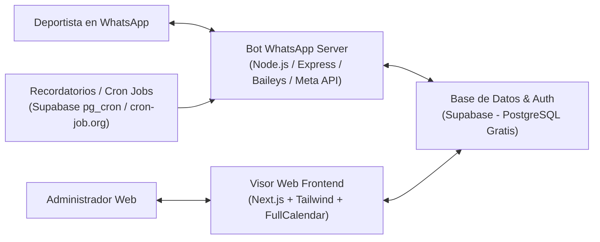

# Plan de Acción: Sistema Automatizado de Reservas Deportivas vía WhatsApp & Visor Web

Este documento define la hoja de ruta técnica, arquitectura de soluciones, tecnologías seleccionadas y análisis de costos (garantizando **$0 USD / 100% Gratuito**) para el proyecto basado en el **Borrador Canvas**.

---

## 1. Alcance y Objetivos del Sistema

A partir del borrador analizado, el sistema resolverá la sobreventa, dobles reservas, ausencias (*no-shows*) y carga operativa manual mediante dos componentes conectados en tiempo real:

1. **Bot de WhatsApp 24/7 (Cliente Final / Deportista):**
   - Consulta interactiva de canchas y disponibilidad en tiempo real.
   - Flujo guiado de reserva de turnos (deporte, fecha, franja horaria).
   - Gestión de anticipos económicos (QR Nequi/Daviplata o enlace de pago).
   - Confirmación inmediata y envío de recordatorios automáticos previos al partido.

2. **Visor Web de Gestión (Administrador del Complejo):**
   - Calendario visual interactivo (vista diaria, semanal y por canchas).
   - Bloqueo manual de horarios (mantenimiento, lluvia, torneos).
   - Parametrización de canchas, horarios de atención y tarifas dinámicas (horas pico / valle).
   - Auditoría de reservas, validación de anticipos y métricas de ingresos / ocupación.

---

## 2. Arquitectura Tecnológica 100% Gratuita (Costo $0)

Para garantizar costo cero en desarrollo, pruebas y puesta en producción para los primeros clientes, utilizaremos el nivel gratuito (*free tier*) de plataformas líderes:

### Tabla de Tecnologías y Nivel Gratuito

| Componente | Tecnología Seleccionada | Proveedor / Servicio | Límite del Plan Gratuito | Costo |
| :--- | :--- | :--- | :--- | :--- |
| **Base de Datos** | PostgreSQL (Relacional) | **Supabase** | 500 MB almacenamiento, 50.000 usuarios activos/mes, WebSockets en tiempo real | **$0** |
| **Frontend Web** | React 19 + Vite + Tailwind CSS + Lucide | **Vercel** | Despliegue continuo CI/CD, SSL HTTPS automático, ancho de banda ilimitado para MVP | **$0** |
| **Componente Calendario** | Componente visual en tiempo real | Open Source (MIT) | Gratuito sin límites | **$0** |
| **Servidor Bot / API** | Node.js (TypeScript/Express) | **Render** o **Supabase Edge Functions** | 750 horas/mes de computación gratuita (suficiente para correr 24/7) | **$0** |
| **Canal WhatsApp** | **Opción 1:** WhatsApp Cloud API (Meta) **Opción 2:** Baileys / Evolution API | Meta for Developers / WhatsApp Web QR | **Meta:** 1.000 conversaciones de servicio al mes gratis. **Baileys:** Ilimitado (conexión por QR a número propio). | **$0** |
| **Validación Pagos** | Nequi / Daviplata (QR + subida de comprobante) | Almacenamiento Supabase Storage (1 GB gratis) | Subida de comprobante y confirmación automática con 1 clic | **$0** |
| **Cron / Recordatorios** | Cron-job.org o loop interno | cron-job.org | Ejecución de tareas programadas cada 15 min | **$0** |
| **Total Mensual** | | | | **$0 USD / $0 COP** |

---

## 3. Modelo de Datos Central (PostgreSQL / Supabase)

El diseño de la base de datos asegura transacciones atómicas para impedir dobles reservas mediante exclusión GiST.

---

## 4. Fases de Ejecución del Proyecto

### Fase 1: Estructura del Proyecto y Base de Datos (Semana 1)
- [x] Creación de carpeta `desarrollo`.
- [x] Configuración del proyecto base estructurado (`database/`, `backend/`, `frontend/`).
- [x] Creación de scripts SQL para el esquema de base de datos (`schema.sql` con exclusión GiST anti-sobreventa, enums, triggers y RPC de disponibilidad).
- [x] Plantilla de variables de entorno y guía de configuración con Supabase (Nivel Gratuito).

### Fase 2: Visor Web Administrativo - MVP (Semana 2)
- [x] Creación de la aplicación web con React 19 + Vite + Tailwind CSS + Lucide Icons.
- [x] Implementación de vista de calendario interactivo por franjas horarias y canchas.
- [x] Funcionalidad de bloqueo manual de franjas horarias y creación de reservas manuales.
- [x] Tarjetas de métricas financieras (ingresos proyectados, anticipos Nequi/Daviplata, reservas confirmadas).
- [x] Simulador de WhatsApp embebido directamente en el visor web para pruebas instantáneas.

### Fase 3: Motor del Bot de WhatsApp (Semana 3)
- [x] Implementación del servidor webhook de WhatsApp (Node.js/Express) con verificación Meta.
- [x] Flujo conversacional paso a paso (saludo, selección de cancha, consulta de disponibilidad en tiempo real, pre-reserva temporal y confirmación con pago de anticipo).
- [x] Endpoint de simulación inmediata en frontend y pruebas integradas.

### Fase 4: Módulo de Notificaciones y Recordatorios (Semana 4)
- [x] Servicio de recordatorios automáticos preventivos (`reminderService.ts`) despachados vía WhatsApp 2 horas antes de cada juego.
- [x] Endpoint de cron `POST /api/cron/recordatorios` con ciclo de ejecución en segundo plano cada 5 minutos.
- [x] Liberador automático de reservas expiradas tras 15 minutos sin confirmación de pago.
- [x] Sincronización en tiempo real vía WebSockets entre Supabase y el Visor Web.

### Fase 5: Despliegue en la Nube y Validación Piloto (Semana 5)
- [x] Guía de despliegue a costo $0 documentada en `desarrollo/GUIA_DESPLIEGUE_NUBE.md`.
- [x] Configuración lista para Vercel (Frontend), Render (Backend), Supabase (Base de Datos) y cron-job.org (Recordatorios).
